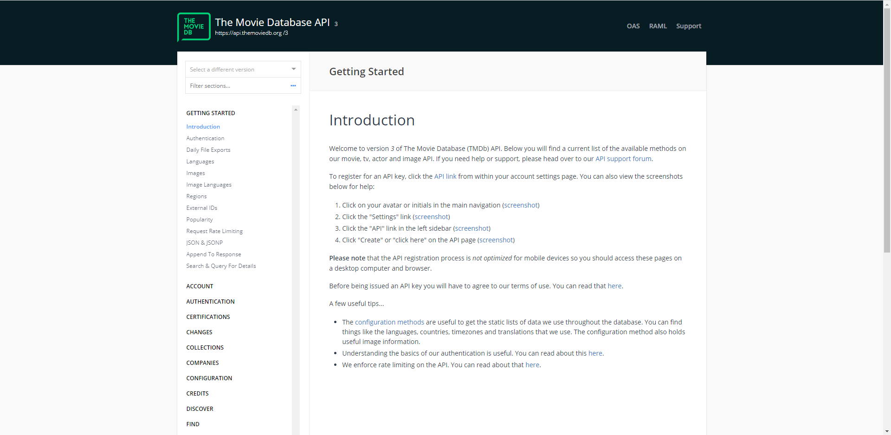

<h1 align="center">
    
</h1>

<h2 align="center">
	:construction: TheOpenMovieDB-Clone-Graphql-Service 🚀 In progress.. :construction:
</h2>

<h3 align="center">
  

  

  

  

  

  
</h3>

This project contains of all the source code for my current personal project, The Open Movie DB clone.

This project will only contain the Back-end code, the front-end code will be stored in a seperate reposity which can be found [here](https://github.com/AlexMachin1997/TheOpenMovieDB-Graphql-Example)

## README contents

As part of the README file it will describe and explain the following sections:

- Purpose
- Core features
- Technologies used
- Getting started
- Testing
- Reporting issues
- Feature requests
- Project information

## Purpose

The TheOpenMovieDB-Clone-Graphql-Service is a simple GraphQL service which allows client-side applications to search for movies, tv shows, celebrities. This is also possible thanks to [TheOpenMovieDB](https://developers.themoviedb.org/3) public facing RESTful API interface

While most of the heavy will work will done by their API it will be this API's job to ensure all the data is optimized and transformed into a useable format for the client-sides state management library, [apollo-client](https://www.apollographql.com/docs/react/).

## Core features

As of the current version of the GraphQL service, it is currently capable of performing the following tasks:

- Search for Movies, TV Shows, People

- Search for a Movies, Person and Show

- Search for a movies and shows reviews, cast, crew, reccomendations, keywords, social and videos

- Discover films and shows

- Search the most popular movies, shows and people

- Search for movies and shows which are currently playing

- Search for upcoming movies and shows

- Search for top rated movies and shows

- Filter for credits, this is an indvidual endpoint for filtering through a persons credits by categories ike acting, writing, producing etc

- Provide a cache via the apollo-server caching mechanism, it will currently cache for 1 hour
- Generate the endpoints based on the config provided through the env variables

- Providing various utils for certain situations e.g. convering values to percentages, replacing object keys, generating custom dates etc

- Clear and easy to understand documention which is automatically generated by the apollo-server, it inteligently knwons all the schemas and resolvers

## Technologies used:

### Core Dependencies

- [apollo-server](https://www.npmjs.com/package/apollo-server)
- [axios](https://www.npmjs.com/package/axios)
- [dotenv](https://www.npmjs.com/package/dotenv)
- [lodash](https://www.npmjs.com/package/lodash)
- [moment](https://www.npmjs.com/package/moment)
- [nodemon](https://www.npmjs.com/package/nodemon)

### Development Dependencies

- [eslint](https://www.npmjs.com/package/eslint)
- [eslint-config-airbnb-base](https://www.npmjs.com/package/eslint-config-airbnb-base)
- [eslint-config-prettier](https://www.npmjs.com/package/eslint-config-prettier)
- [eslint-plugin-import](https://www.npmjs.com/package/eslint-plugin-import)
- [eslint-plugin-prettier](https://www.npmjs.com/package/eslint-plugin-prettier)
- [jest](https://www.npmjs.com/package/jest)
- [prettier](https://www.npmjs.com/package/prettier)

## Getting started

- Clone the project to your development environment by using `git clone https://github.com/AlexMachin1997/TheOpenMovieDB-Graphql-Example.git`

- Install all dependencies for the application by issuing this command `npm install` **(Excludes all development dependencies e.g. prettier, eslint, jest etc)**

## Unit and integration testing setup

To get started with the testing suites you will need to install all the development dependencies used for the application. To install the dependencies use `npm run devDependencies`, this will install all the development dependencies. By choosing install all the development dependencies you will be able to run unit and integration tests aswell as linting and prettifying the applications code.

The Applications tests

- GraphQL resolver mocking **(COMING SOON)**

- Checks all the date functionality still works

- Checks all the external dependencies can be generated and be what they should be.

- Checks images can generate an absolute image url

- Checks the "Discover" endpoints queryParamerts can be generated

- Checks all the object utils work as expected e.g. updating object keys

- Checks all the resolver specific utils work as expected e.g. sorting data

## Contributing

### Reporting issues

If you find any problems while using the API, report them [here](https://github.com/AlexMachin1997/TheOpenMovieDB-React-Example/issues), and I will address them as quick as I can.

### Feature requests

If you would like to request features for future versions of the application again, please post them [here](https://github.com/AlexMachin1997/TheOpenMovieDB-Graphql-Example/issues). When posting ideas ensure the functionality is explained to provide any developers contributing to the project know what to implement.

### Implimenting features

If you would like to impliment a feature in the issues list or refactor existing code (Withut breaking exisitng functionality), feel free to form the repo and submit a [PR](https://github.com/AlexMachin1997/TheOpenMovieDB-Graphql-Example/pulls) detailing all the changes mades.

# Project Information

### Author information

Alex Machin

If you want to connect with me on my professional social network platforms feel free to use the links located below, but please don't abuse them.

- [LinkedIn](https://www.linkedin.com/in/alex-machin/)
- [Twitter](https://twitter.com/AlexMachin97)

### Application Versioning

The application is currently at version 1.0.0, with each feature added it will increment based on these [guidelines](https://docs.npmjs.com/about-semantic-versioning)

### Project Licence information

This project is licensed under the MIT License, for more details about the PWA refer to the LICENCE.md file located within the project.
